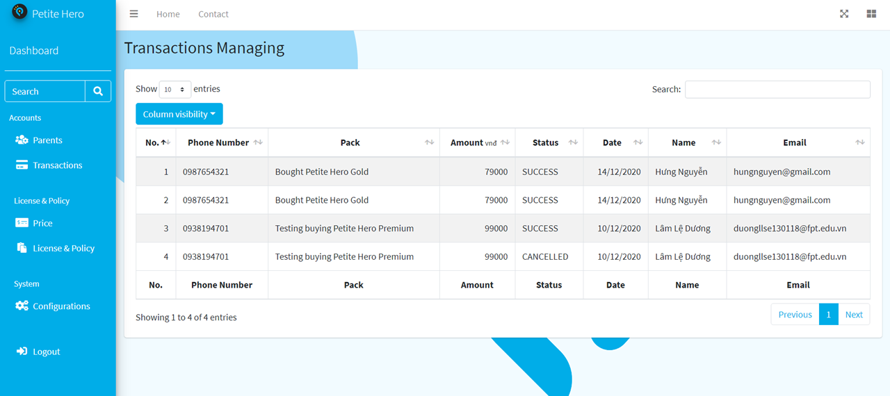

# [PETITE HERO](https://github.com/petite-hero) - FPT University Capstone Project

__*Petite Hero - Children Management and Development Application*__ is an inter-specialization project for FPT University graduation thesis, realized by Software Engineering and Graphic Design students.

The project's product consists of 4 main components:
- A [Server](https://github.com/petite-hero/petite-hero-api) for requests handling
- A [Mobile Application](https://github.com/petite-hero/petite-hero-mobile) for parents
- A [Smartwatch Application](https://github.com/petite-hero/petite-hero-smartwatch) for children
- A [Web Application](https://github.com/petite-hero/petite-hero-web) for administrators

__*Official TVC*__: https://youtu.be/8nKs7YcEEaE  
__*Project Demonstration*__: https://youtu.be/i3ZhxKtDCWA  

# Contributors

__*Software Engineering Specialization*__:
- [Nguyễn Phú Hưng](https://github.com/hulk1999)
- [Võ Lam Trường](https://github.com/truongvlit)
- [Lâm Lệ Dương](https://github.com/llduong)
- [Âu Đức Tuấn](https://github.com/ibenrique2510)

__*Graphic Design Specialization*__:
- Hàn Lê Khanh
- Trần Nguyễn An Khang

# 
# Petite Hero - Admin Web Application
- Language: Javascript
- Framework: AngularJS
- Developed on VSCode

# Functionalities
1. User Account Management
2. License & Policy Management
3. System Configuration Management

# Installation Instructions
1. Make sure back-end side is running properly
2. Open project by VSCode
3. Install Live Server extension on VSCode
4. Change the IP address in constants.js file
5. Open index.html and "Go Live" with Live Server

# Screenshots
## 1. Authentication

## 2. User Account Management
**Account List**

**Account Details**

**Transaction List**

## 3. License & Policy Management
**Subscription Packs**

**Create a Pack**

**Replace a Pack**

**License & Policy**

## 4. System Configuration Management

# Demonstration
