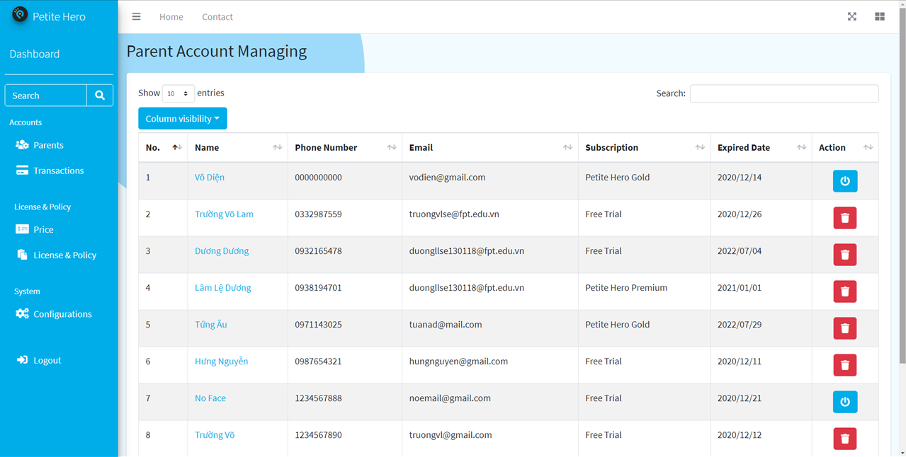
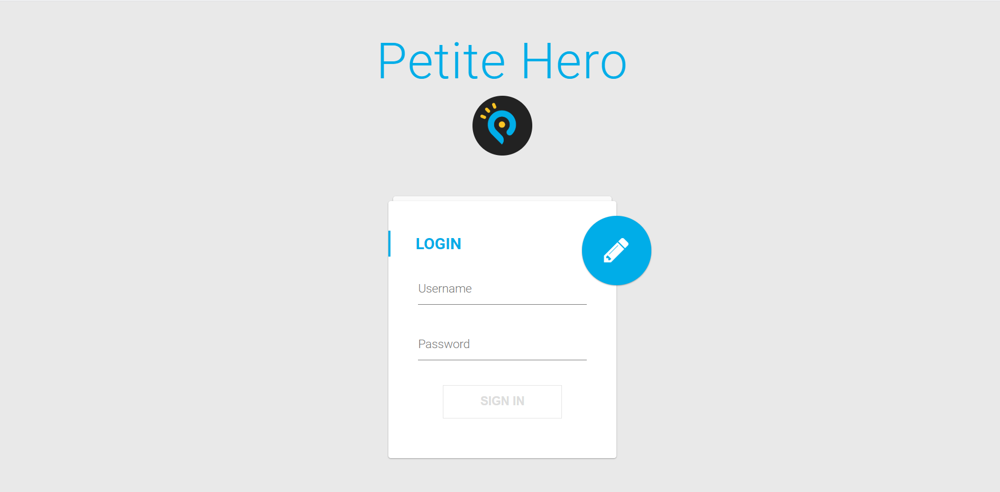
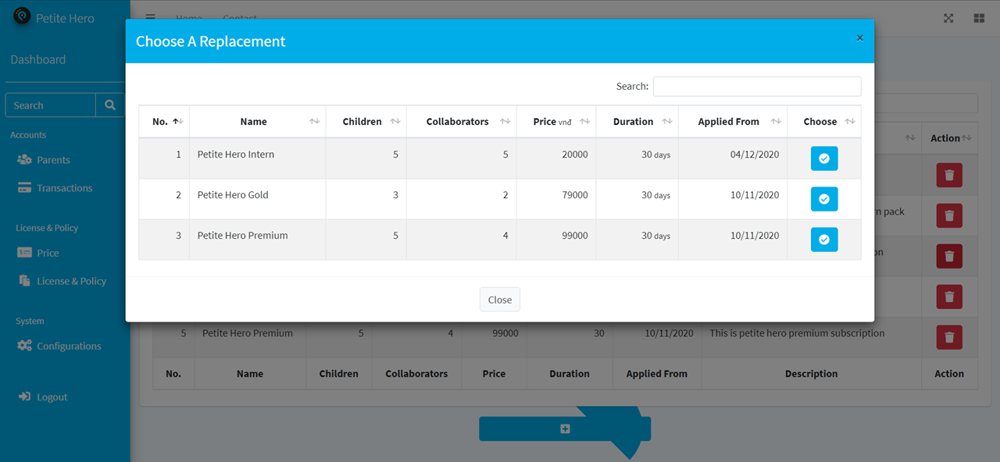

# [PETITE HERO](https://github.com/petite-hero) - FPT University Capstone Project
Children Management and Development Application

# Admin Web Application
- Language: Javascript
- Framework: AngularJS
- Developed on VSCode

# Contributors
- [Nguyễn Phú Hưng](https://github.com/hulk1999)
- [Võ Lam Trường](https://github.com/llduong)
- [Lâm Lệ Dương](https://github.com/llduong)
- [Âu Đức Tuấn](https://github.com/ibenrique2510)

# Functionalities
1. User Account Management
2. License & Policy Management
3. System Configuration Management

# Installation Instructions
1. Make sure back-end side is running properly
2. Open project by VSCode
3. Install Live Server extension on VSCode
4. Change the IP address in constants.js file
5. Open index.html and "Go Live" with Live Server

# Screenshots
## 1. Authentication

## 2. User Account Management
**Account List**

**Account Details**

**Transaction List**

## 3. License & Policy Management
**Subscription Packs**

**Create a Pack**

**Replace a Pack**

**License & Policy**

## 4. System Configuration Management
